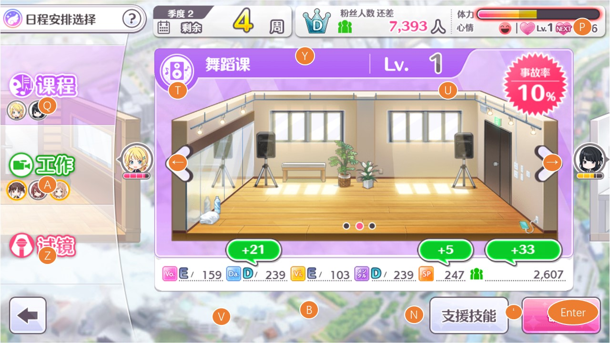

# shinymas键盘助手

新加八连休，autofes脚本。

进入到produce后，按 "8" 启动八连休，按 "0" 结束。

在fesTop页面，按 "5" 自动选择彩排easy，第二把刀依次打各裁判，五个周期，正常可以打完5个体力。

图示：




## 使用说明

运行程序test.py，默认窗口大小是我电脑的全屏尺寸

定位：

运行程序后 鼠标移动到游戏窗口左上角按下 \` 按键 ，再移动到右下角 按下 \`（可多次定位，重新点击左上角和右下角即可）

按键说明：

T/Y/U：个人剧情，morning，约束上方三个选项

Q/A/Z：选择vo/da/vi裁判或lesson/工作/试镜

V/B/N：选择下面三把刀

Enter：回忆炸弹 / 一系列确定键

Space：点击当前位置，主要用于试镜中点条

P：skip

'：四倍速按键

Tab：暂停程序

Esc：结束程序

操作技巧：

各类事件过场通过长按进行连点，会快速过渡

休息与技能设定相关的按键，注意切换鼠标等设备

小心误操作

## 安装说明

安装参考了[CSDN](https://blog.csdn.net/jiuhu7/article/details/105493201)

```shell
# 目前仅在window下测试过
# 使用pymouse库，最好在python38以下版本
conda create -n py36 python=3.6.12
conda activate py36

# 下载whl https://www.lfd.uci.edu/~gohlke/pythonlibs/#pyhook
pip install pyHook-1.5.1-cp36-cp36m-win_amd64.whl
pip install pyWinhook-1.6.2-cp36-cp36m-win_amd64.whl
pip install pymouse
pip install PyUserinput
```

或者使用这里打包好的应用程序 [release页面](https://github.com/qq519043202/ShinyMasKeyboard/releases)

或者[pyautogui](https://github.com/asweigart/pyautogui)操作键鼠更优雅，更方便。但是使用时产生了某个bug，并且打包后的文件体积巨大，难以处理放弃使用了

[pyautogui](https://github.com/asweigart/pyautogui)点击会有延迟？以前使用pymouse时也碰到过，但是解决了，解决方法未知。

键盘鼠标监听相关库：[pyWinhook](https://github.com/Tungsteno74/pyWinhook) [Demo](https://github.com/Tungsteno74/pyWinhook/blob/master/pyWinhook/example.py)

## todo
- [x] 键盘监听

- [x] 鼠标操作

- [x] 执行脚本

- [ ] 录制脚本（有生之年

- [ ] 打包发布

  ```shell
  # pymouse打包可能出出现这个问题, bug1
  # TypeError: KeyboardSwitch() missing 8 required positional arguments: 'msg', 'vk_code', 'scan_code', 'ascii', 'flags', 'time', 'hwnd', and 'win_name'
  
  # 出现了一个之前没有的bug，弃用PyInstaller，改用Nuitka后分发模式的打包还有点问题...
  nuitka --mingw64 test.py --show-progress # 暂时可自用，分发会有问题。
  nuitka --mingw64 --follow-imports test.py # 线程中止有问题，分发会有问题
  nuitka --mingw64 --follow-imports --standalone test.py # bug1
  ```

- [ ] 改进代码

- [ ] 跨平台(Linux, MacOs

## other

shinykey.xlsx 为我全屏时各按键的坐标

keepbgm.txt 是参考插件代码，不通过插件实现离开游戏画面保持音乐播放的方式（没地方放就放这里了

